# 							Crypto-Server Documentation :Version[1.0]

### How to run

java -jar cryptoserver-0-0-1-SNAPSHOT.jar

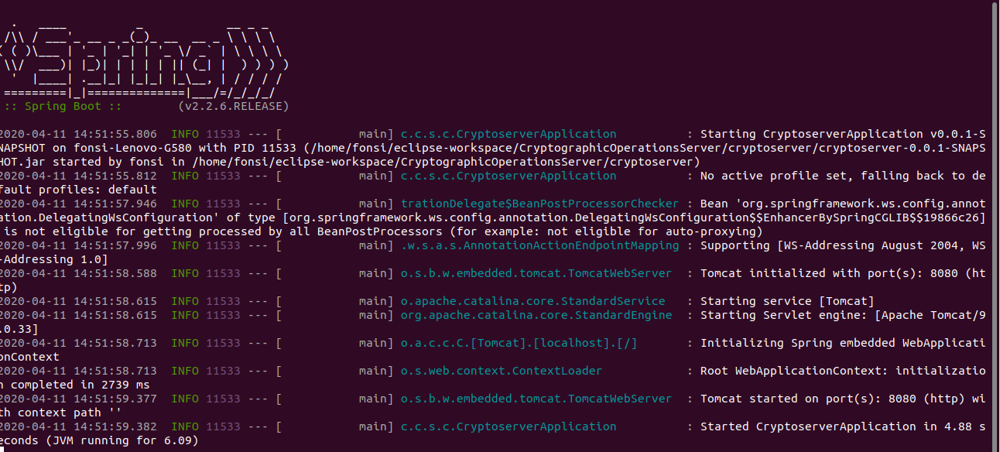

or 

run like java application the class : CryptoServerApplication.java from your IDE

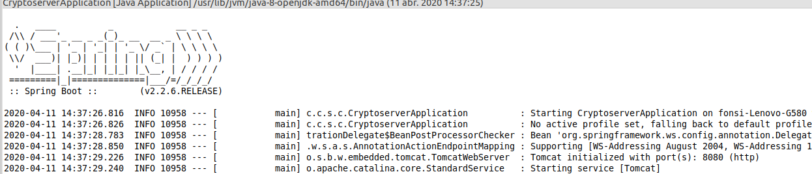

### Functionalities

The crypto-server application allow multiple functionalities, using interface from your  browser or with an API rest for integrate it with other web applications (the authentication/authorization methods, there aren't develop yet )

## Backend - WebServer rest API 

	private static final String SIGN_MAPPING = "/services/sign-jdk-service";
	private static final String CERTIFICATES_MAPPING = "/services/certificates-jdk-service";
	private static final String ENCRYPT_BC_MAPPING = "/services/encrypt-bc-service";
	private static final String DECRYPT_BC_MAPPING = "/services/decrypt-bc-service";
	private static final String ENCODE_MAPPING = "/services/encode-service";
	private static final String DECODE_MAPPING = "/services/decode-service";
	private static final String HASH_MAPPING = "/services/hash-service";
	
Swagger interface:

- http://localhost:8080/swagger-ui.html

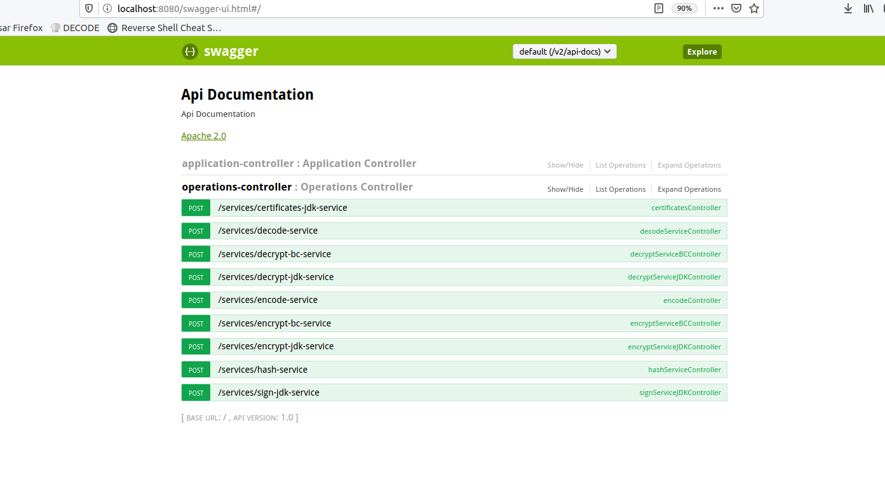

http://localhost:8080/services/

	#encrypt:
		encrypt-jdk-service:
			- algorithms allowed for Symetric encryption: 3DES/AES/RC2/RC4/Blowfish
			- algorithms allowed for Asymetric encryption: RSA
		 encrypt-bc-service:
			- envelop operation using BouncyCastle engine: RSA+[3DES/AES/CAMELIA/CASTS]	
	#decrypt:
		decrypt-jdk-service:
			- algorithms allowed for Symetric decryption: 3DES/AES/RC2/RC4/Blowfish
			- algorithms allowed for Asymetric decryption: RSA
		decrypt-bc-service:
			- envelop operation using BouncyCastle engine: RSA+[3DES/AES/CAMELIA/CASTS]	
	#sign:
		 sign-jdk-service:
		 	- using RSA algorithm for sign and verify sign operations
		 		-The asymetic algorithm sign with private key and verify with publickey
	#encode:
		 encode-jdk-service:
		 	- encode input data to:
		 		- Base64 format
		 		- Hexadecimal format
		 		- Url format
		 		- Binary format
	#decode:
		 decode-jdk-service:
		 	- decode input data from:
		 		- Base64 format to ascii
		 		- Hexadecimal format to ascii
		 		- Url format to ascii
		 		- Binary format to ascii
	#certificates:
	     certificate-jdk-service:
	     	- Allow generate a simple self-signed certificate with input values
	     	- Allow generate keypair (public and private keys) and self-signed certificates for use it on operations
	#hash data:
	     hash-jdk-service:
	     	- Allow hash input data for integrity verification using algorithms:SHA-1/SHA-256/SHA-384/SHA-512/MD2/MD5
	     		
	     	
## FrontEnd 

# http://localhost:8080/

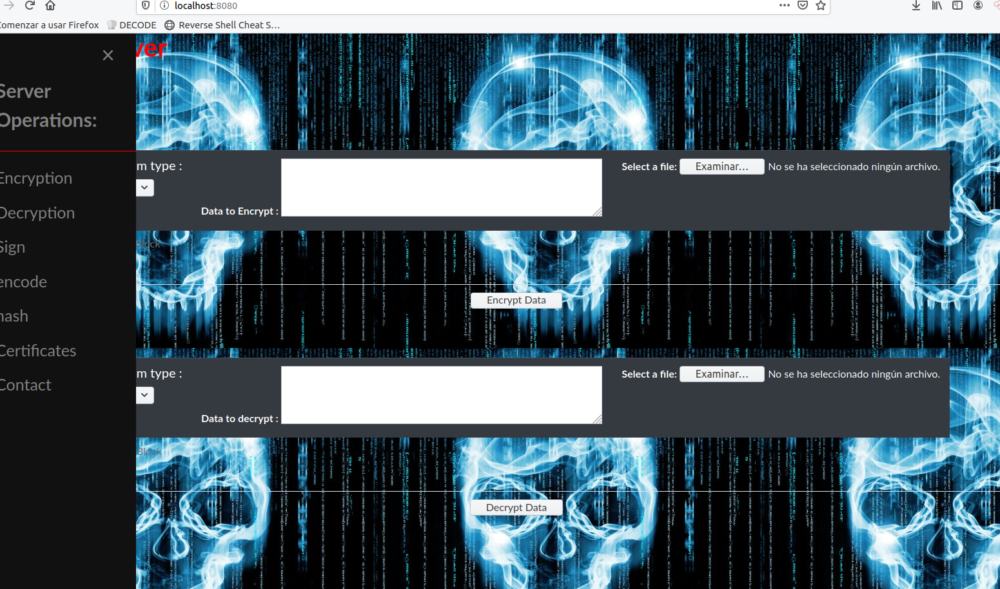

# http://localhost:8080/encrypt

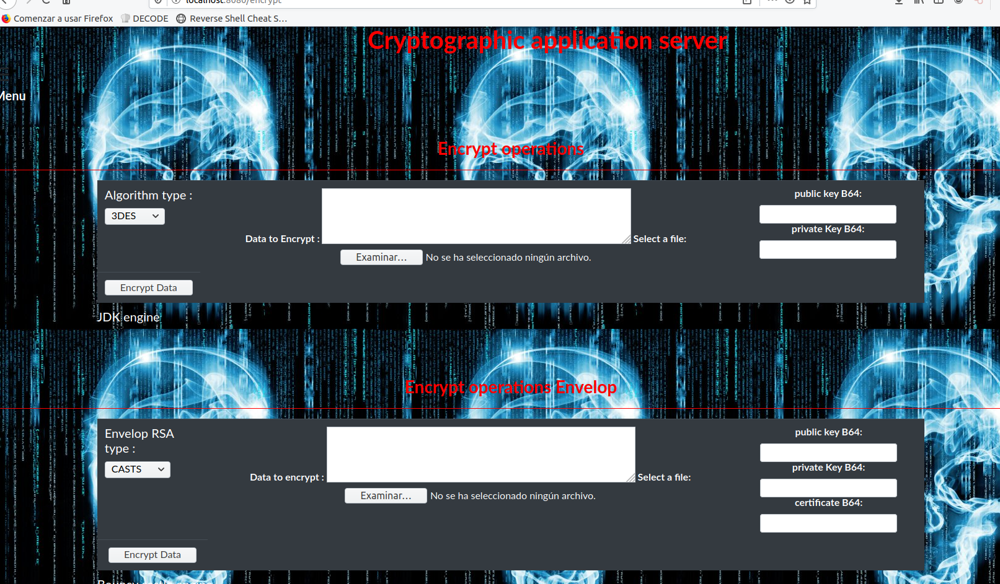

# http://localhost:8080/decrypt

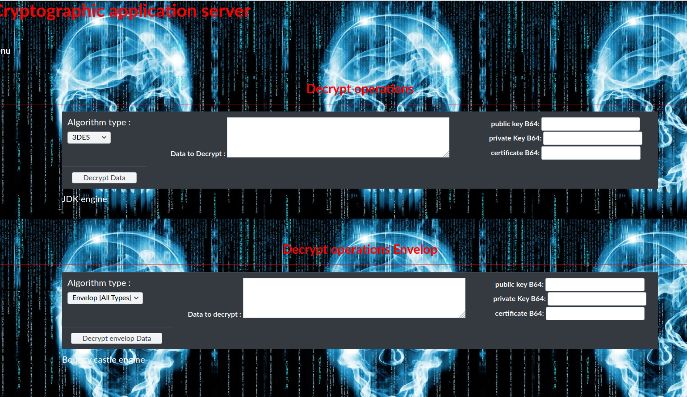

# http://localhost:8080/sign

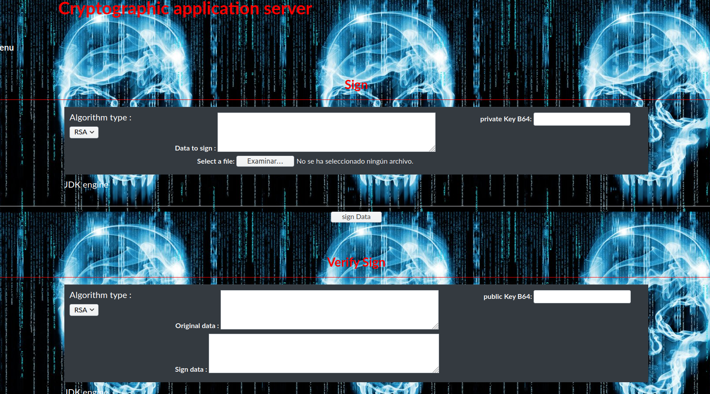

# http://localhost:8080/encode

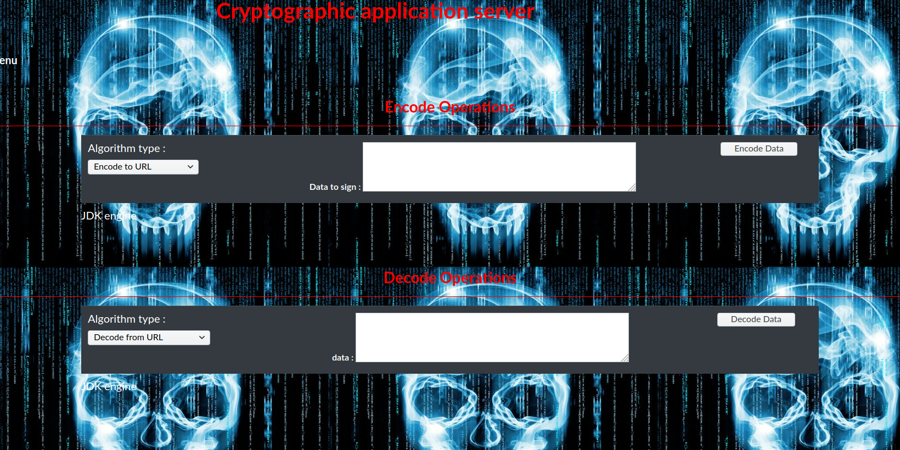

# http://localhost:8080/certificates

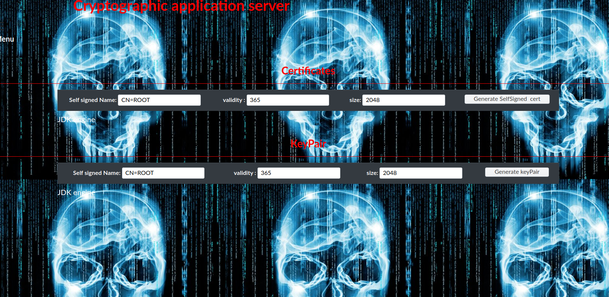

# http://localhost:8080/hash

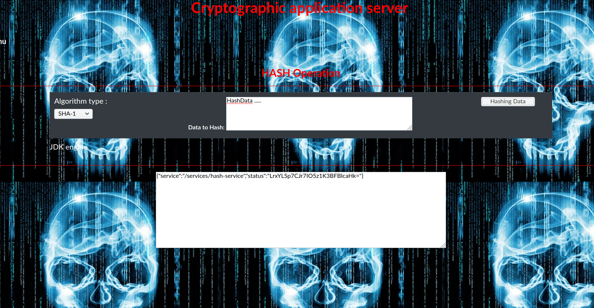

# http://localhost:8080/contact

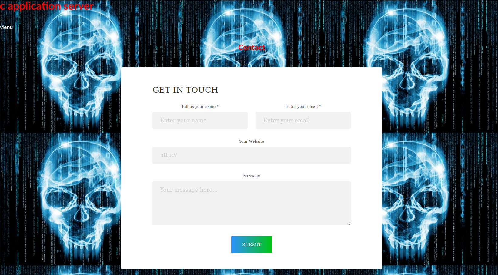

contact: fonso.gonzalezsan@gmailcom

